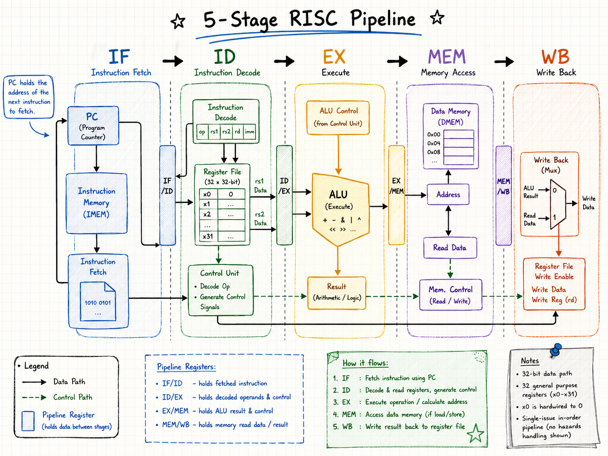
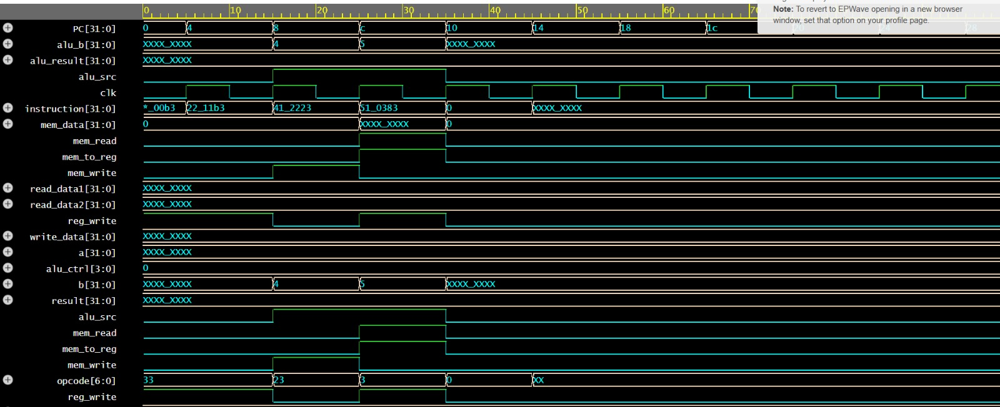

# 5-Stage RISC Pipeline Processor Simulation

A 5-stage RISC pipeline processor implemented in **Verilog** and verified through clock-cycle simulation and waveform analysis.

The design models the classic processor stages **Instruction Fetch (IF)**, **Instruction Decode (ID)**, **Execute (EX)**, **Memory Access (MEM)**, and **Write Back (WB)** using modular Verilog components for instruction memory, register storage, control generation, arithmetic operations, data memory, and pipeline state transfer. :contentReference[oaicite:0]{index=0}

  &nbsp;
  &nbsp;
  &nbsp;
  &nbsp;
  

  

<em>Five-stage processor flow showing instruction fetch, decode, execution, memory access, and write-back.</em>

---

## Key Features

- **5-stage processor flow:** IF → ID → EX → MEM → WB
- **32-bit instruction and data paths**
- **32-register register file** with two read ports and one write port
- **Instruction memory** with word-aligned addressing
- **Control unit** for opcode-based control signal generation
- **ALU support for ADD and SUB operations**
- **Data memory support** for load and store behavior
- **Pipeline register logic** for stage-to-stage state transfer
- **Clock-driven processor simulation**
- **Waveform-based verification** using generated VCD output

The project materials describe the five stages and the modular components used to represent instruction memory, register file, ALU, control logic, data memory, and pipeline registers. :contentReference[oaicite:1]{index=1} :contentReference[oaicite:2]{index=2}

---

## Pipeline Stages

### 1. Instruction Fetch — IF

The program counter is used to fetch the current instruction from instruction memory. The PC advances by 4 for sequential 32-bit instruction access. :contentReference[oaicite:3]{index=3} :contentReference[oaicite:4]{index=4}

### 2. Instruction Decode — ID

The instruction is decoded and the required source registers are read from the register file. The control unit examines the opcode and generates signals such as `mem_read`, `mem_write`, `reg_write`, `alu_src`, and `mem_to_reg`. :contentReference[oaicite:5]{index=5} :contentReference[oaicite:6]{index=6}

### 3. Execute — EX

The ALU performs arithmetic operations using the register values or an instruction-derived operand depending on the control signals. The ALU module supports ADD and SUB behavior. :contentReference[oaicite:7]{index=7}

### 4. Memory Access — MEM

The data-memory module handles processor memory reads and writes using the `mem_read` and `mem_write` control signals. :contentReference[oaicite:8]{index=8}

### 5. Write Back — WB

The processor selects either the memory output or ALU result and routes it back to the register file through the write-back path. :contentReference[oaicite:9]{index=9}

---

## Main Verilog Modules

- `instruction_memory.v` — stores and fetches 32-bit instructions
- `register_file.v` — implements 32 general-purpose registers
- `control_unit.v` — decodes instruction opcodes and generates processor control signals
- `alu.v` — performs ADD and SUB arithmetic operations
- `data_memory.v` — handles memory reads and writes
- `pipeline_registers.v` — stores state between pipeline stages
- `risc_pipeline.v` — integrates the processor components
- `testbench.v` — generates the clock and waveform output

The source code uses a 256-word instruction memory and data memory, a 32-entry register file, opcode-driven control logic, and a VCD-generating testbench. :contentReference[oaicite:10]{index=10} :contentReference[oaicite:11]{index=11} :contentReference[oaicite:12]{index=12} :contentReference[oaicite:13]{index=13}

---

## Supported Instruction Behavior

The project simulation includes examples representing:

- **ADD**
- **SUB**
- **LW**
- **SW**
- **NOP**

The instruction memory contains binary-encoded examples for these operations, while the control unit distinguishes load, store, and R-type instruction opcodes. :contentReference[oaicite:14]{index=14} :contentReference[oaicite:15]{index=15}

---

## Verification & Results

A Verilog testbench generates a clock and records processor activity into `wave.vcd` for waveform inspection. :contentReference[oaicite:16]{index=16}

The simulation was used to observe instruction flow, program-counter progression, opcode changes, control signals, memory behavior, register selections, and ALU-related activity across clock cycles.

  

<em>Waveform simulation showing PC progression, instruction activity, control signals, register indices, and memory-related behavior across clock cycles.</em>

The project report states that the processor behavior was checked across the pipeline stages and that ADD, SUB, LW, and SW operations were observed through simulation and waveform analysis. :contentReference[oaicite:17]{index=17} :contentReference[oaicite:18]{index=18}

---

## Pipeline Concept

The five-stage structure allows different instructions to occupy different stages during the same clock cycle:

    Instruction 1 → WB
    Instruction 2 → MEM
    Instruction 3 → EX
    Instruction 4 → ID
    Instruction 5 → IF

This illustrates instruction-level parallelism and the main throughput advantage of processor pipelining. :contentReference[oaicite:19]{index=19}

---

## Challenges & Debugging

During development, the main challenges included:

- Managing binary instruction encoding
- Tracking data movement between processor stages
- Debugging opcode and control-signal behavior
- Interpreting waveform activity across multiple clock cycles

Waveform inspection was used to help identify signal and control-flow issues during simulation. :contentReference[oaicite:20]{index=20}

---

## Future Improvements

Potential extensions include:

- Add **hazard detection**
- Add **data forwarding**
- Support additional instruction types
- Expand ALU functionality
- Extend pipeline register handling
- Improve branch and control-flow support

The project presentation specifically identifies hazard handling and additional instruction types as possible future extensions. :contentReference[oaicite:21]{index=21}

---

## Academic Project

Developed for **ECE 622 — Digital Systems Structure** at **California State University, Northridge**.
